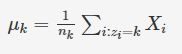

# Unsupervised Learning:Clustering

## Introduction to Clustering

### Introduction
Welcome to the module on 'Unsupervised Learning'. In the previous modules, you learnt about several supervised learning techniques such as regression and classification. These techniques use a training set to make the algorithm learn, and then apply what it learnt to new, unseen data points.

In this module, you will be introduced to unsupervised learning.

#### In this session
You will start by learning what “clustering” is. It is an unsupervised learning technique, where you try to find patterns based on similarities in the data. Then, you will be introduced to a case study that shows the applicability of clustering in the industry.

You will learn the two most commonly used types of clustering algorithms - **K-Means Clustering** and **Hierarchical Clustering**, as well as their application in Python. Then, you will also look at what segmentation is and how it is different from clustering.

## Understanding Clustering
In the previous modules, you saw various supervised machine learning algorithms. Supervised machine learning algorithms make use of labelled data to make predictions.

For example, an email will be classified as spam or ham, or a bank’s customer will be predicted as ‘good’ or ‘bad’. You have a target variable Y which needs to be predicted.
 
On the other hand, in unsupervised learning, you are not interested in prediction because you do not have a target or outcome variable. The objective is to discover interesting patterns in the data, e.g. are there any subgroups or ‘clusters’ among the bank’s customers?

Let’s learn clustering in detail.

### PRACTICAL APPLICATIONS OF CLUSTERING
1. **Customer Insight**: Say, a retail chain with so many stores across locations wants to manage stores at best and increase the sales and performance. Cluster analysis can help the retail chain to get desired insights on customer demographics, purchase behaviour and demand patterns across locations. This will help the retail chain for assortment planning, planning promotional activities and store benchmarking for better performance and higher returns.
2. **Marketing**: Cluster Analysis can help with In the field of marketing, Cluster Analysis can help in market segmentation and positioning, and to identify test markets for new product development.
3. **Social Media**: In the areas of social networking and social media, Cluster Analysis is used to identify similar communities within larger groups.
4. **Medical**: Cluster Analysis has also been widely used in the field of biology and medical science like human genetic clustering, sequencing into gene families, building groups of genes, and clustering of organisms at species. 

In the next segment, you will be introduced to a real-life application of clustering — grouping customers of an online store into different clusters and making a separate targeted marketing strategy for each group. We will be using this example throughout the module.

## Practical Example of Clustering - Customer Segmentation
In the last segment, you got a basic idea of what clustering is. So let’s consider a real-life application of the unsupervised clustering algorithm.

**You can download the data set for the case study from below. We will be using the same data for Python Lab.**  
[Online Retail Data Set](dataset/Online+Retail.csv)

Lets say you run an online retail store and you want to group your exsisting customers into different segments so as to make specific marketing strategies for them. This is called customer segmentation. Now we don't have any predefined labels to classify the customers into nor we know what will be the charachteristic of the group that eventually will be form. Its only after the grouping have been form we can analyse the charachteristic of the group to derieve actionable insights. Thus such a problem is classified as unsupervised clustering problem.

Customer segmentation for targeted marketing is one of the most vital applications of the clustering algorithm. Here, as a manager of the online store, you would want to group the customers into different clusters, so that you can make a customised marketing campaign for each of the group. You do not have any label in mind, such as good customer or bad customer. You want to just look at patterns in customer data and then try and find segments. This is where clustering techniques can help you with segmenting the customers. Clustering techniques use the raw data to form clusters based on common factors among various data points. This is exactly what will also be done in segmentation, where various people or products will be grouped together on the basis of similarities and differences between them.

As a manager, you would have to decide what the important business criteria are on which you would want to segregate the customers. So, you would need a method or an algorithm that itself decides which customers to group together based on this criteria.

Sounds interesting? Well, that is the beauty of unsupervised learning, especially clustering. But before we conclude this introductory session, it would be best to get an industry perspective on the application of clustering in the world of analytics.

**Difference between clustering and segmentation**
1. Clustering is an analytics technique.
2. Segmentation is a business problem/case.

To be able to do segmentation we use clustering technique. Clustering technique can be used in multiple places. We can segment/cluster multiple things:

You saw that, for successful segmentation, the segments formed must be stable. This means that the same person should not fall under different segments upon segmenting the data on the same criteria. You also saw that segments should have **intra-segment homogeneity** and **inter-segment heterogeneity**. You will see in later sessions how this can be defined mathematically.

Now you will see what types of market segmentations are commonly used.

The 3 types of segmentation are used for customer segmentation:

1. **Behavioural segmentation**: Segmentation is based on the actual patterns displayed by the consumer
2. **Attitudinal segmentation**: Segmentation is based on the beliefs or the intents of people, which may not translate into similar action
3. **Demographic segmentation**: Segmentation is based on the person’s profile and uses information such as age, gender, residence locality, income, etc.

#### Additional reading
You can read more about business cases where clustering is used here (https://www.jigsawacademy.com/cluster-analysis-for-business/)4

#### Summary
In this session, we covered the basics of unsupervised learning and also got a little idea about how clustering works. In the next sessions, you will go deeper into the details of clustering and learn about the 2 common clustering algorithms — the K-Means algorithm and the Hierarchical clustering algorithm.

### K Means Clustering

#### Introduction

Welcome to the session on 'K-Means Clustering'. In the previous session, you got a basic idea of what unsupervised learning is. You also learnt about one such unsupervised technique called clustering. Now let's dive deeper into the concept and learn about the first common algorithm to achieve this unsupervised clustering — the K-Means algorithm.

### Steps of the Algorithm
Let’s go through the K-Means algorithm using a very simple example. Let’s consider a set of 10 points on a plane and try to group these points into, say, 2 clusters. So let’s see how the K-Means algorithm achieves this goal.

Before moving ahead, think about the following problem. Let’s say you have the data of 10 students and their marks in Biology and Math (as shown in the plot below). You want to divide them into two clusters so that you can see what kind of students are there in the class.

The y-axis shows the marks in Biology, and the x-axis shows the marks in Math.

Imagine two clusters dividing this data — one red and the other yellow. How many points would each cluster have?

### Centroid
The K-Means algorithm uses the concept of the centroid to create K clusters. Before you move ahead, it will be useful to recall the concept of the centroid (https://en.wikipedia.org/wiki/Centroid).

In simple terms, a centroid of n points on an x-y plane is another point having its own x and y coordinates and is often referred to as the geometric centre of the n points.

For example, consider three points having coordinates (x1, y1), (x2, y2) and (x3, y3). The centroid of these three points is the average of the x and y coordinates of the three points, i.e.

(x1 + x2 + x3 / 3, y1 + y2 + y3 / 3).

Similarly, if you have n points, the formula (coordinates) of the centroid will be:

(x1+x2…..+xn / n, y1+y2…..+yn / n). 

So let’s see how the K-Means algorithm achieves this goal. In K-means k stands for number of clusters.

Note that the initial choice of cluster centers(yellow and red one) is completely random. Then in step one we will allocate each point in the dataset to the nearest cluster center. To do this we calculate the distance of each datapoint to the two cluster centers i.e. the centroid and allocate the point to the centroid with the least distance. We will use euclidean distance as a common measure for calculating this.

Now we can see we have set of points allocated to the yellow centroid and a set of points allocated to the red centroid. So in effect we have two clusters now. This set is a assigment step where each point is assigned to a cluster.

The next step is to recompute the center of each of these clusters which will simply be the mean of individual points in each of the clusters. Then we will get our new cluster centers. This is the optimasation step.

Now again we will go to assignment step and will assign each datapoint to the nearest cluster center using the same method as discussed earlier.

We again update the position of the cluster center for both the clusters. We keep iterating through this process of assignment and optimisation till the centroids no longer update. At this point the algorithm has reached optimal grouping and we have got our two clusters.  
So essentially K-means is a algorithm that take n datapoints and group them into k-clusters. Grouping is done in the way to maximize the tightness/closeness of the points among a cluster while maximizing the distance between the clusters.

[Clustering Activity File](dataset/Clustering_activity_K_Means.xlsx)

### K Means Algorithm
In the previous segment, we learned about K-means clustering and how the algorithm works using a simple example. We learned about how assignment and the optimisation work in K Means clustering, We will look K-means more algorithmically. We will be learning how the K Means algorithm proceeds with the assignment step and then with the optimisation step and will also be looking at the cost of function for the K-means algorithm.

Let's understand the K-means algorithm in more detail.
We understood that the algorithm’s inner-loop iterates over two steps:

In the next segment, we will learn about the Kmeans cost function and will also see how to compute the cost function for each iteration in the K-means algorithm.

So the cost function for the K-Means algorithm is given as: 

We will learn what exactly happens in the assignment step? and we will also look at how to assign each data point to a cluster using the K-Means algorithm assignment step.

In the assignment step, we assign every data point to K clusters. The algorithm goes through each of the data points and depending on which cluster is closer, in our case, whether the green cluster centroid or the blue cluster centroid; It assigns the data points to one of the 2 cluster centroids.

The equation for the assignment step is as follows:

Now having assigned each data point to a cluster, now we need to recompute the cluster centroids. In the next section, we will explain how to recompute the cluster centroids or the mean of each cluster.

In the optimisation step, the algorithm calculates the average of all the points in a cluster and moves the centroid to that average location.

The equation for optimisation is as follows:

The process of assignment and optimisation is repeated until there is no change in the clusters or possibly until the algorithm converges.

In the next segment, we will learn how to look K-Means algorithm as a coordinate descent problem. We will also learn about the constraint of the K-Means cost function and how to achieve global minima.

**Additional Reading**
You may go through this document(http://thespread.us/clustering.html).

## K Means as Coordinate Descent
In the previous segment, we learned that the K-means algorithm iterate between two steps.
1. In the first step, we assign each observation to the nearest cluster centre.
2. In the second step, we update the cluster center.

If we carefully look into the first step in which we are assigning each step to the nearest cluster center, we are minimising the objective function. In general, we want the cluster assignment in such a way that the corresponding cost can be reduced.

In the next segment, we will look that the K-Means cost function is a non-convex function, which means the coordinate descent is not guaranteed to converge to the global minimum and the cost function can converge to local minima. Choosing the initial value of K centroids can affect the K-Means algorithm and its final results.

**Additional Reading**
1. In the previous lecture, we got an idea that the K-Means algorithm is not a convex clustering algorithm. To find a convex solution for K-means, there is a technique called Support Vector Clustering.(http://citeseerx.ist.psu.edu/viewdoc/download?doi=10.1.1.92.9806&rep=rep1&type=pdf) In Support Vector Clustering,  we describe a smooth boundary around the data points for which we need to state the length scale for the Gaussian Kernel to define how smooth we want the boundary to be. 
2. To understand more about Convex and Non-Convex cost function, you may go through this YouTube link (https://www.youtube.com/watch?v=LxjL_yLaFS8&feature=youtu.be).

## K Means++ Algorithm
We looked in the previous segment that for K-Means optimisation problem, the algorithm it iterate between two steps and tries to minimise the objective function given as,

We also looked that the K-Means cost function is a non-convex function, which means the coordinate descent is not guaranteed to converge to the global minimum. The problem with K-Means is to initialise the cluster centers to achieve the global minima smartly. 

To choose the cluster centers smartly, we will learn about K-Mean++ algorithm. K-means++ is just an initialisation procedure for K-means. In K-means++ you pick the initial centroids using an algorithm that tries to initialise centroids that are far apart from each other.

### Visualising the K Means Algorithm
Let’s see the K-Means algorithm in action using a visualisation tool. This tool can be found on naftaliharris.com (https://www.naftaliharris.com/blog/visualizing-k-means-clustering/). You can go to this link and play around with the different options available to get an intuitive feel of the K-Means algorithm.

Upon trying the different options, you may have noticed that the final clusters that you obtain vary depending on many factors, such as choice of the initial cluster centres and the value of K, i.e. the number of clusters that you want. You will understand these factors and other practical considerations while using the K-means algorithm in more detail in the next segment.

### Practical Consideration in K Means Algorithm
Let’s understand some of the factors that can impact the final clusters that you obtain from the K-means algorithm. This would also give you an idea about the issues that you must keep in mind before you start to make clusters to solve your business problem.

The major practical considerations involved in K-Means clustering are:
1. The number of clusters that you want to divide your data points into, i.e. the value of K has to be pre-determined.
2. The choice of the initial cluster centres can have an impact on the final cluster formation. The K-means algorithm is **non-deterministic**. This means that the final outcome of clustering can be different each time the algorithm is run even on the same data set. This is because, as you saw, the final cluster that you get can vary by the choice of the initial cluster centres.
3. The clustering process is very sensitive to the presence of outliers in the data.
4. Since the distance metric used in the clustering process is the Euclidean distance, you need to bring all your attributes on the same scale. This can be achieved through standardisation.
5. The K-Means algorithm does not work with categorical data.
6. The process may not converge in the given number of iterations. You should always check for convergence.

You will understand some of these issues in detail and also see the ways to deal with them when you implement the K-means algorithm in Python.

Now let's look in detail how to choose K for K-Means algorithm.

Having understood about the approach of choosing K for K-Means algorithm, we will now look at silhouette analysis or silhouette coefficient. Silhouette coefficient is a measure of how similar a data point is to its own cluster (cohesion) compared to other clusters (separation).

**Additional reading**
You can read more about K-Mode clustering here(https://shapeofdata.wordpress.com/2014/03/04/k-modes/), We will be covering it in detail in the next section.

### Cluster Tendency
Before we apply any clustering algorithm to the given data, it's important to check whether the given data has some meaningful clusters or not? which in general means the given data is not random. The process to evaluate the data to check if the data is feasible for clustering or not is know as the clustering tendency.

As we have already discussed in the previous segment that the clustering algorithm will return K clusters even if that data does not have any clusters or have any meaningful clusters. So before proceeding for clustering, we should not blindly apply the clustering method and we should check the clustering tendency.

To check cluster tendency, we use Hopkins test. Hopkins test examines whether data points differ significantly from uniformly distributed data in the multidimensional space.

**Additional Resources**

To read about Hopkins test in detail, please follow this link1 (https://www.datanovia.com/en/lessons/assessing-clustering-tendency/#methods-for-assessing-clustering-tendency), link2(https://stats.stackexchange.com/questions/332651/validating-cluster-tendency-using-hopkins-statistic), remember that the document is described using R programming, please ignore it.

### Executing K Means in Python

#### Introduction
Welcome to the segment on 'Executing K-Means in Python'. In the previous segment, you got a basic understanding of what clustering is and how you can use the K-Means algorithm to cluster objects. In this session, you will see the implementation of the K-Means algorithm in Python on the Online Retail case study that was introduced earlier. 

We first need to aggregate the dataset at customer level from the order level details. For each customer, you need to have attributes or features depending upon which you do the clustering. A common practice in the field of marketing to group customers is through the RFM analysis i.e.

Thus a recency of 30 means customer has not made any purchase in the last 30 days. Similarly a frequency of 50 means that customer has made 50 purchases in the last one year. Lastly Monetary Value gives the total dollar amount of the purchase made by the customer in the last one year. Thus we need to transform the dataset from order wise to customer wise and compute these RMF attributes for each customer.

You saw the steps to performing the data preparation. Now let’s do the same in Python. You can download the data set for the case study from this link here:

[Online Retail Dataset](dataset/Online+Retail.csv)

Let’s begin the analysis by importing libraries and the data set into Python.

Let's start with some preliminary data cleaning. Now, as you can notice, the data set is at the granularity of order level. So, it doesn’t make much sense to do missing value imputation because it would be very difficult to predict the individual missing details of individual orders. Hence, you have to remove the entries with the missing values.

But, if you remember, our main objective is to cluster the customers of the online store. So, you need to transform this order-wise data into customer-wise data by finding key attributes that best characterises a customer. This is achieved through RFM analysis.

**RFM analysis**  
In RFM analysis, you look at the recency, frequency and the monetary scores of all the customers for segmentation.
1. **Recency**: It measures how recently you visited the store or made a purchase
2. **Frequency**: It measures the frequency of the transactions the customers made
3. **Monetary**: It measures how much the customer spent on purchases he/she made

So, your target is to compute the RFM numbers for each customer, which effectively means that the granularity level of your data set will change from Invoice number to the CustomerID. Thus, you will have one unique row corresponding to each customer.

Let’s start with creating customer-wise data. We begin with the computation of M of the RFM, that is the total monetary value of the purchases made by each customer.

Create a vector named Amount, which creates the total monetary value of each order, and append the column to your data set.

Now, sort the data set in order of CustomerID. Next, create a new vector — monetary — which gives the aggregated purchase amount for each customer.

Next, let’s compute the frequency of purchase for each customer, i.e. the F of the RFM framework. For this, you will count the number of unique Invoice Numbers for each Customer ID.  This is the “Frequency” corresponding to each customer.

Finally, merge this data frame with the “Frequency” of each customer into your earlier data set containing the “Monetary” value.

Thus, the data frame master contains both the monetary and the frequency attributes corresponding to each customer IDs. Now, you have to turn your attention towards the computation of the recency, i.e. for how long a customer has not visited the online store.

Begin by extracting the Customer ID and Invoice Date from the data. Now, find the latest “Invoice Date” which forms the reference point for the calculation of the “Recency” of each customer. For each order corresponding to each customer, you find the difference from the latest “Invoice Date” and then find the minimum “Recency” value for each customer.

Now, the data frame recency contains the recency for each customer. Let’s merge it to the RFM data set and change the format to the required form.

Thus, you have obtained the RFM data corresponding to each customer. These 3 attributes will form the basis, depending on which the customers will be segregated into different clusters.

However, your data preparation is still not complete. You have already seen previously how the clustering process can be impacted due to the presence of outliers. So, let’s treat the data set for outliers. One way to do it is by eliminating all the data points which fall outside the 1.5 times the IQR of the 1st and the 3rd quartile.

Now, you have done the basic data preparation. Let’s see if any other steps are required before you can make the clusters.  

So, the data preparation is now complete. So, let’s reiterate the steps involved in data preparation:
* Missing value treatment
* Transforming data from Order-level to Customer-level
* Calculation of RFM values
* Outlier treatment
* Standardisation of data (Since the scales of the data are different, more weightage will be given to Monetary value. Data points which have very different monetary values will be classified differently, even though they might actually be very similar in Recency and Frequency. So that's why we did scaling)

In the next segment, you will begin with the actual implementation of the K-Means algorithm in Python.

### Making the Clusters
Hope you had fun in preparing the data for clustering. You can find the Python Notebook containing all the commands used.

[Clustering - Online Store](dataset/K--Mean--Clustering.ipynb)

**Please note that results for the cluster may vary since random_state is not used in the K-Means code.**

Now, you will actually create clusters on the cleaned data. Let's see how this is done.

Here, let's try to understand the different parameters from Scikit Learn Documentation:

* **n_clusters**: The number of clusters to form as well as the number of centroids to generate
* **init**: Method for initialization of the cluster centres
* **n_init**: Number of time the k-means algorithm will be run with different centroid seeds. The final results will be the best output of n_init consecutive runs in terms of inertia (explained below).
* **max_iter**: Maximum number of iterations of the k-means algorithm for a single run in case it doesn't converge on its own

Let's now try to understand the output of the KMeans() function.
* **cluster_centers**: Coordinates of cluster centres
* **labels**: Labels of each point i.e. the labels to which the points belong
* **inertia**: Sum of squared distances of points to their closest cluster centre

Now the question arises, how do we really decide the number of cluster centres or in other words, the value of K in the K-Means algorithm?

As you saw, business constraints are one of the factors that help decide the value of K. However, there is a mathematical route as well to arrive at the optimal value of K. This is done through the **elbow curve method**.

You have seen earlier that KMeans() stores the sum of the squared distance of the points to their respective clusters centres as **inertia**. In other words, inertia represents, how tightly the different clusters are formed. As we increase the number of clusters, the inertia value is bound to decrease as the individual clusters become more compact. Thus, the plot of inertia against the number of clusters becomes a monotonically decreasing plot.

However, in this plot (Fig 1), you can notice a distinct elbow. Beyond the elbow point, the additional (marginal) decrease in inertia with each increase in the cluster number is not very prominent. Thus, the elbow in the curve gives an estimate of the optimal number K in K Means.

Now let's implement the elbow curve method to see what would be the optimal number of K in our case. We would use a loop to store the inertia value while changing the value of K from 1 to 21.

We will also be looking at Hopkins statistics in Python to check if our data has some meaningful clusters or not. Together with Hopkins and SSD, we will also test our clusters using Silhouette analysis.

You found that cluster 5 was the best customer segment from the store’s point of view. These customers make a purchase for a higher amount, more frequently, and these customers had visited the site recently. Thus, the store may offer them a reward or loyalty points or some privileged status, to keep them attracted and coming back to the store.

On the other hand, cluster 3 had the worst customers from the store’s point of view. Thus, the store may decide to focus more on this group. Similarly, in cluster 1, the customers had favourable features in terms of the purchase amount and recency; however, these have low frequency. Thus, if the store can re-design its incentive strategy and entice these customers into making a purchase more frequently, they could turn profitable for the store.

### Let's Have Some Fun
You have learnt about how to make clusters using the K-Means algorithm. Let's use that knowledge to play around with clustering using K-Means.

Given below is a data set on the education status of Indian states.

[Indian Census Data](dataset/India.xlsx)

The data contains state-level information on attributes such as the number of literates, illiterates, the number of literates who are graduate and above, etc.

But there’s a problem — the number of variables is quite large, and after forming the clusters, it may get difficult to describe each cluster’s characteristics.

This is not an uncommon problem. You may have noticed data sets having as many as 100-200 variables. There are techniques which are used to ‘reduce the number of variables while retaining as much information as possible’.

Two most common techniques, also called variable reduction techniques, are factor analysis and principal component analysis.

Lawmakers can cluster the states to find out which states have similar education statistics, and thus assign the budget accordingly. Clustering can also help them figure out the best policies to make for these clusters.

You can download the data set and run the K-Means algorithm on this. You can try to make the clusters on different attributes. 

For the purpose of creating the visualisation, we have cleaned the data to include only the 2 factors under consideration. You could have chosen any other factors as well. Factors here mean the variables that you will use to build the clustering model. You can download the file below to answer the questions that follow:

[Cleaned File](dataset/Main.xlsx)

### Other Behavioural Segmentation Types
You have seen what RFM segmentation is. Now, you will look at other segmentation types commonly used in the industry.

You looked at RPI segmentation, which looks at what kind of relationship you have had with the person before, what type of person he/she is, and the intent of the person at the time of buying. RPI segmentation is done more for the contexual marketing.

You also looked at the CDJ segmentation, which looks at the path that customers take while experiencing your product.

Now, let us turn our attention to another clustering technique — hierarchical clustering — in the next session.

**Notes**
This is also what happens in the industry practices that we run the algorithm multiple times with different values of K and then pick the clusters which make the most business sense. In fact, the k-means algorithm finds large application in the industry. For example, it can be used to find out the most optimal centre to install the mobile towers by clustering the customers geographically. Similarly, it has wide application in medical science, where say the patients can be clustered together on the basis of their symptoms, and then analysed to figure out the cause of their illness.

However, K means was just one of the clustering algorithm. In the next session, we will learn about another clustering algorithm called hierarchical clustering, which does not require you to decide the number of clusters beforehand.

[Cricket Dataset](dataset/Cricket.csv)

[Cricket Clustering](dataset/Cricket.ipynb)

